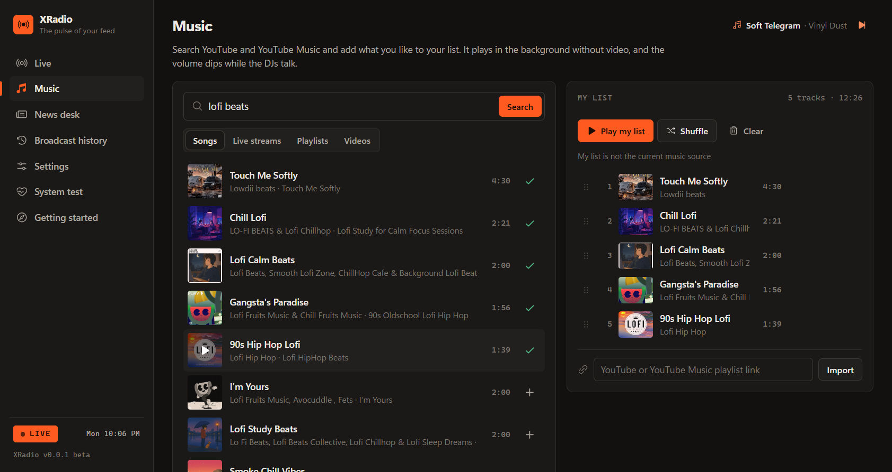
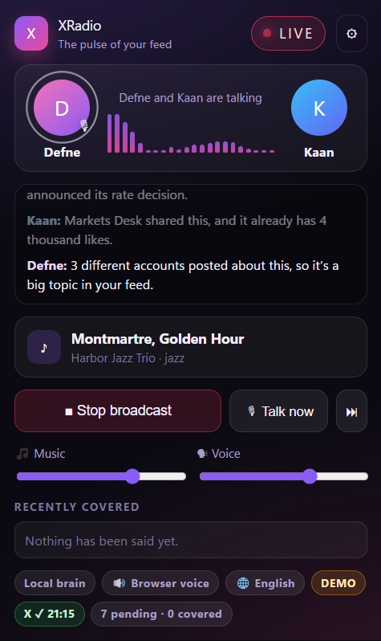
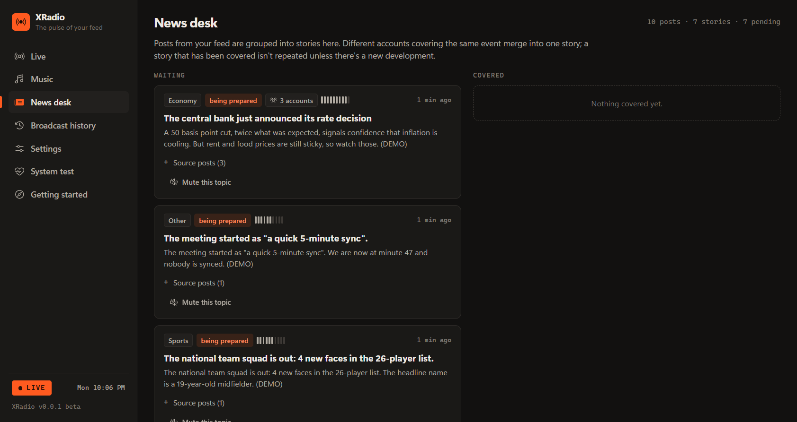

# XRadio — your X feed, on air

**Two AI radio DJs read your X (Twitter) timeline for you and talk you through what matters, over music, in your language.** Stop refreshing X. Just listen.

`v0.0.2 beta` · Edge & Chrome extension · [Türkçe](README.tr.md)


> **Beta.** This is an early release (0.0.x). Expect rough edges, and please report them in [Issues](../../issues).

## What it does

- **Two DJs, real banter.** Defne and Kaan discuss your feed like a real radio show. They react to each other, laugh at each other's jokes and sometimes cut in.
- **Music in the background.** A YouTube live stream or playlist (lo-fi, jazz, synthwave…) keeps playing and fades down whenever the DJs talk.
- **Your own music, Spotify-style.** Search YouTube Music and YouTube right inside the studio (songs, live streams, playlists), build *My list* with drag-and-drop ordering and shuffle, or import any YouTube / YouTube Music playlist by link. It plays audio-only in the background; no API key needed.
- **No repeats.** Posts about the same event are merged into one story. A story is told once, and only comes back if there's a real new development.
- **Breaking news.** Truly urgent events (an earthquake, say) interrupt the music. It never turns into a wall of "BREAKING".
- **No tweets read aloud.** The DJs summarize in their own words. Posts in other languages are translated.
- **15 languages.** Detected from your browser on first run, and you can change it any time.
- **Radio button on X.** While you browse x.com, a radio button sits above the Grok and Chat buttons (same look). Click it to open the full player inside the page. Refreshing the page doesn't interrupt the broadcast.
- **Focus shield.** If you open X out of habit, you get the radio's status instead of the feed.
- **Light and dark themes.** Follows your system, or pick one in Settings.
- **Works without an API key.** The free local mode uses your browser's voices (English and Turkish). Add a free Gemini key for realistic voices and smarter commentary.

## Install

1. Download **`xradio-0.0.2.zip`** from [Releases](../../releases) and unzip it. (Or clone this repo and use the `extension/` folder.)
2. Open the extensions page:
   - **Edge:** `edge://extensions`
   - **Chrome:** `chrome://extensions`
3. Turn on **Developer mode**.
4. Click **Load unpacked** and select the unzipped folder (the one that contains `manifest.json`).
5. Pin XRadio from the puzzle-piece menu. The **Getting started** page opens on its own.

## Use

1. **Pick the broadcast language.** It's detected from your browser on first run.
2. **Stay logged in to x.com** in the same browser. XRadio reads your home timeline in a small pinned tab.
3. *(Optional)* Paste a **Gemini API key** from [aistudio.google.com/apikey](https://aistudio.google.com/apikey) for natural two-voice speech.
4. Choose your music and press **Start broadcast**.

No X account handy? Click **Try the demo broadcast**, which uses a fictional sample feed.

**Shortcuts:** `Alt+Shift+R` start/stop · `Alt+Shift+G` talk now · `Alt+Shift+N` skip



| Popup | News desk |
|---|---|
|  |  |

## Privacy

- Everything runs **in your browser**. There are no XRadio servers and no analytics.
- XRadio only **reads** your home timeline. It never posts, likes or follows.
- With a Gemini key, post text is sent to Google's Gemini API using **your** key to write and voice the show. The key is stored only in your browser's local storage.
- Without a key, nothing leaves your browser except your own music searches, which go to YouTube (only when you search).

## For developers

```bash
npm install          # test tooling only (Playwright)
npm test             # unit tests
npm run test:e2e     # loads the extension in Chromium with a mock Gemini server and a mock x.com
                     # BROWSER=edge or BROWSER=chrome runs it in your installed browser (separate temp profile)
npm run pack         # builds dist/xradio-<version>.zip
npm run icons        # re-embeds the Phosphor icons used by the UI
npm run screenshots  # regenerates the README screenshots (THEME=light for the light theme)
```

No build step: the extension is plain ES modules in `extension/`. Detailed technical notes (in Turkish) are in [docs/TECHNICAL.tr.md](docs/TECHNICAL.tr.md).

## Credits & disclaimer

Built with **Claude Opus 5.5** (Anthropic): design, code and tests. Voices and writing are powered by Google Gemini (optional). Icons: [Phosphor Icons](https://phosphoricons.com) (MIT).

XRadio is an independent project and is not affiliated with X Corp., Google or YouTube. The DJs summarize unverified social media posts and AI can make mistakes, so check important news with official sources.

## License

[MIT](LICENSE)
