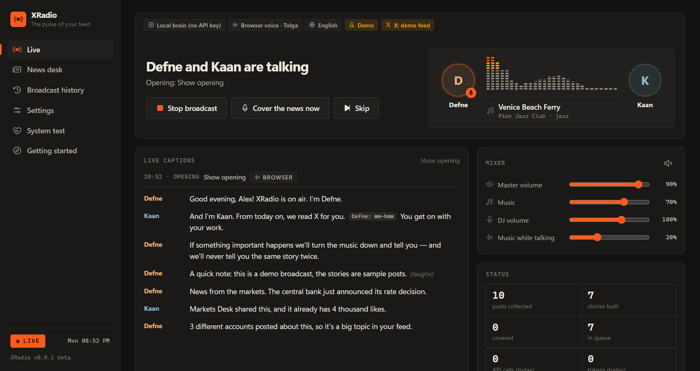

# XRadio — Gündem Radyosu

**İki yapay zekâ DJ'i X (Twitter) akışını senin yerine okur ve önemli olanı, müzik eşliğinde, kendi dilinde sohbet ederek anlatır.** X'i yenileyip durma; sadece dinle.

`v0.0.1 beta` · Edge ve Chrome eklentisi · [English](README.md)

> **Beta sürümü (0.0.x).** Hatalar olabilir; [Issues](../../issues) üzerinden bildirebilirsin.

## Ne yapar?

- **İki DJ, gerçek sohbet.** Defne ile Kaan gündemi bir radyo programındaki gibi karşılıklı anlatır: birbirine tepki verir, güler, lafı kapar.
- **Arkada müzik.** YouTube canlı yayını ya da oynatma listesi çalar; DJ'ler konuşurken ses yumuşakça kısılır.
- **Tekrar yok.** Aynı olayı anlatan paylaşımlar tek hikâyede birleşir; yeni bir gelişme olmadıkça tekrar anlatılmaz.
- **Son dakika.** Gerçekten acil olaylarda (ör. deprem) müzik kesilir; "SON DAKİKA" yağmuruna dönüşmez.
- **Tweet okumaz.** DJ'ler haberi kendi cümleleriyle anlatır; başka dildeki paylaşımları çevirir.
- **15 dil.** İlk açılışta tarayıcının dilinden seçilir, istediğin zaman değiştirebilirsin.
- **Odak kalkanı.** Alışkanlıkla X'i açarsan akış yerine radyonun durumunu görürsün.
- **Açık ve koyu tema.** Sistem ayarını izler ya da Ayarlar'dan seçilir.
- **Anahtarsız da çalışır.** Ücretsiz yerel mod tarayıcının seslerini kullanır (Türkçe ve İngilizce). Gerçekçi sesler için ücretsiz bir Gemini anahtarı ekleyebilirsin.

## Kurulum

1. [Releases](../../releases) sayfasından **`xradio-0.0.1.zip`** dosyasını indir ve klasöre çıkar. (Ya da depoyu klonlayıp `extension/` klasörünü kullan.)
2. Eklentiler sayfasını aç: **Edge:** `edge://extensions` · **Chrome:** `chrome://extensions`
3. **Geliştirici modu**nu aç.
4. **Paketlenmemiş öğe yükle**'ye tıkla ve çıkardığın klasörü (içinde `manifest.json` olan) seç.
5. Yapboz menüsünden XRadio'yu sabitle. **Başlangıç** sayfası kendiliğinden açılır.

## Kullanım

1. **Yayın dilini seç.** İlk açılışta tarayıcının dilinden algılanır.
2. **x.com'a aynı tarayıcıda giriş yapmış ol.** XRadio ana akışını küçük, sabitlenmiş bir sekmede okur.
3. *(İsteğe bağlı)* [aistudio.google.com/apikey](https://aistudio.google.com/apikey) adresinden aldığın **Gemini API anahtarını** yapıştır.
4. Müziği seç ve **Yayını başlat**'a bas.

X hesabın yoksa **Demo yayınıyla dene** düğmesi kurgusal bir örnek akışla çalışır.

**Kısayollar:** `Alt+Shift+R` başlat/durdur · `Alt+Shift+G` şimdi anlat · `Alt+Shift+N` atla

## Gizlilik

- Her şey **senin tarayıcında** çalışır; XRadio'nun sunucusu ya da istatistik toplaması yoktur.
- X'te sadece **okur**; hiçbir şey paylaşmaz, beğenmez, takip etmez.
- Gemini anahtarı girersen paylaşım metinleri **senin anahtarınla** Google Gemini API'sine gönderilir. Anahtar yalnızca bu tarayıcıda saklanır.
- Anahtarsız modda hiçbir veri tarayıcıdan çıkmaz.

Ayrıntılı teknik belge: [docs/TECHNICAL.tr.md](docs/TECHNICAL.tr.md)

## Emeği geçenler ve uyarı

**Claude Opus 5.5** (Anthropic) ile tasarlandı, kodlandı ve test edildi. Sesler ve metinler (isteğe bağlı) Google Gemini ile üretilir. İkonlar: [Phosphor Icons](https://phosphoricons.com) (MIT).

XRadio bağımsız bir projedir; X Corp., Google ya da YouTube ile bağlantısı yoktur. DJ'ler doğrulanmamış sosyal medya paylaşımlarını özetler ve yapay zekâ hata yapabilir; önemli haberleri resmî kaynaklardan teyit et.

## Lisans

[MIT](LICENSE)
